# Online Ordering and Inventory Management for Café

A full-stack web application for managing online orders and inventory, built with React (Vite) and Node.js (Express). Functionalities include:

**User**
   - Signup/login
   - Adding product to cart
   - Remove product from cart
   - Purchase product(s)

**Admin**
   - View orders summary
   - View trend of orders per product
   - View product sales summary
   - View inventory summary 
   - View inventory composition
   - View low stock items
   - View item catalog
   - View supplier records
   - View total used units per items
   - Manage items, batches, suppliers

## Project Structure
```
project-root/
├── client/       # React + Vite frontend
├── server/       # Node.js backend
```

---

## Setup Instructions

### Prerequisites

- Node.js (v16 or higher)
- npm
- Express
- MongoDB
- Mongoose
- Tailwind CSS
- Stripe
---

## Frontend Setup (React + Vite)

1. Navigate to the frontend directory:
   ```bash
   cd client
   ```

2. Create a .env file with the following:
   ```
   REACT_APP_API_URL=http://localhost:3000
   CHOKIDAR_USEPOLLING=true
   SERVER_URL=http://localhost:8080
   ```

3. Install dependencies:
   ```bash
   npm install
   ```

4. Start the development server:
   ```bash
   npm run dev
   ```

5. Visit the app at:
   ```
   http://localhost:3000
   ```

---

## Backend Setup (Node.js)

1. Navigate to the backend directory:
   ```bash
   cd server
   ```

   **MongoDB Setup Required**
   
   Before running the backend, make sure you have a MongoDB database ready:
   - You can create a free MongoDB Atlas cluster or use a local MongoDB instance.
   - Once created, copy your connection string and update the .env file in the server/ directory:

   ```
   DB=mongodb+srv://<username>:<password>@<cluster>.mongodb.net/?retryWrites=true&w=majority
   ```

   Make sure the database name is cafe or adjust the mongoose.connect() call in index.js accordingly.

2. Create a .env file with following:
   ```
   PORT=3000
   DB=mongodb+srv://<username>:<password>@<cluster>.mongodb.net/?retryWrites=true&w=majority
   DB_PASS={enter-your-DB-password}
   ACCESS_TOKEN_SECRET={enter-your-token-secret}
   ```

3. Install dependencies:
   ```bash
   npm install
   ```

4. Start the server:
   ```bash
   node index.js
   ```
   Or
   ```bash
   npm run start
   ```

5. Backend will run at:
   ```
   http://localhost:3000
   ```

6. Generate mock data (optional)
   ```
   node seeds/seed.js
   ```

---

## Connecting Frontend to Backend

Ensure your frontend API calls point to the backend URL (e.g. `http://localhost:3000`). 

```env
VITE_API_URL=http://localhost:3000
```

And in your frontend code:
```js
fetch(`${import.meta.env.VITE_API_URL}/orders`)
```

---

## Tech Stack

- **Frontend**: React, Vite
- **Backend**: Node.js, Express
- **Other**: Axios, CORS, dotenv, Stripe

---

## Folder Highlights

- `client/src/` — React components, pages, and assets
- `server/` — API routes, business logic, and server config

---
# User Interfaces
## Home
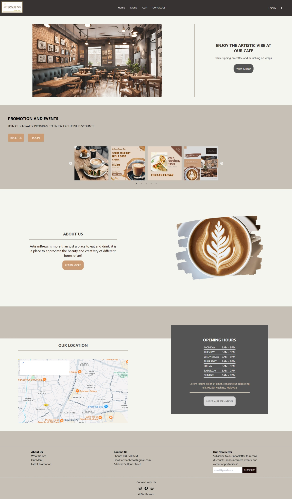

## Login
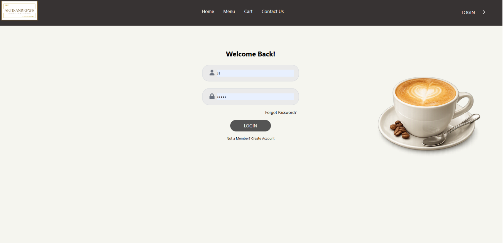

## Register
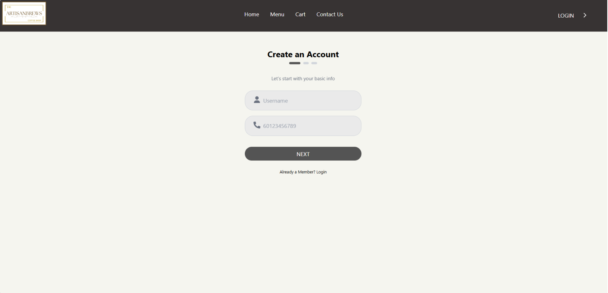

## Menu
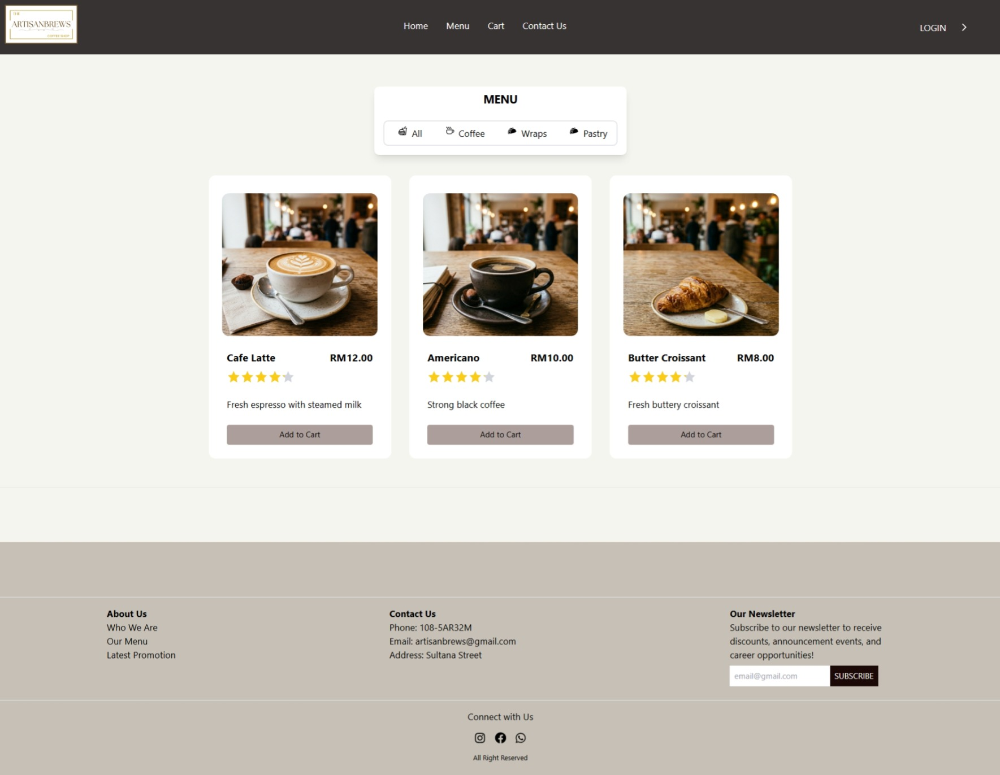

## Cart
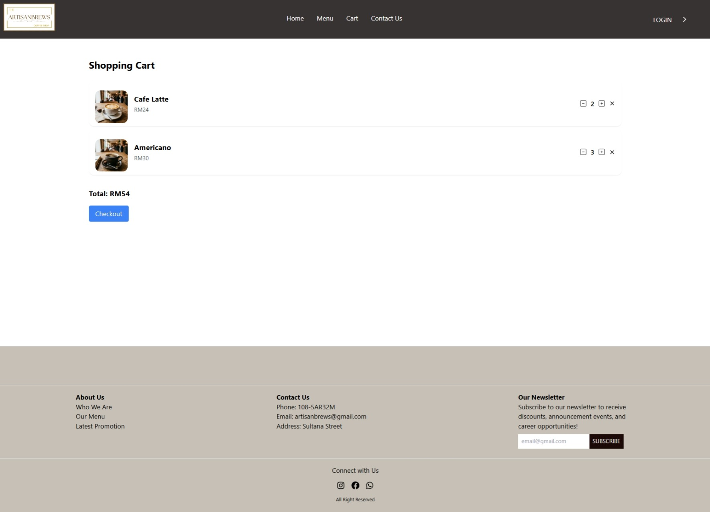

## Contact Us
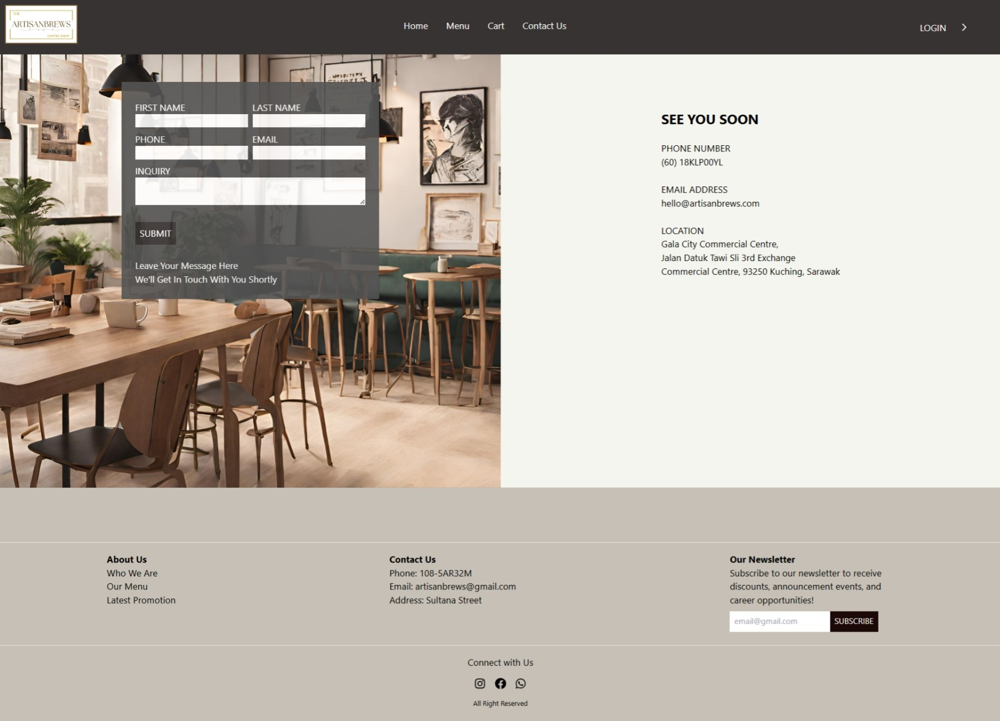

## Admin 
### Orders
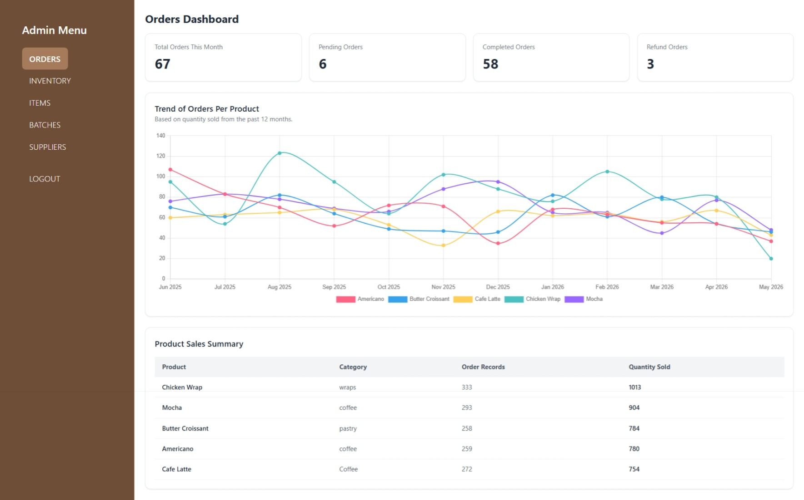

### Inventory
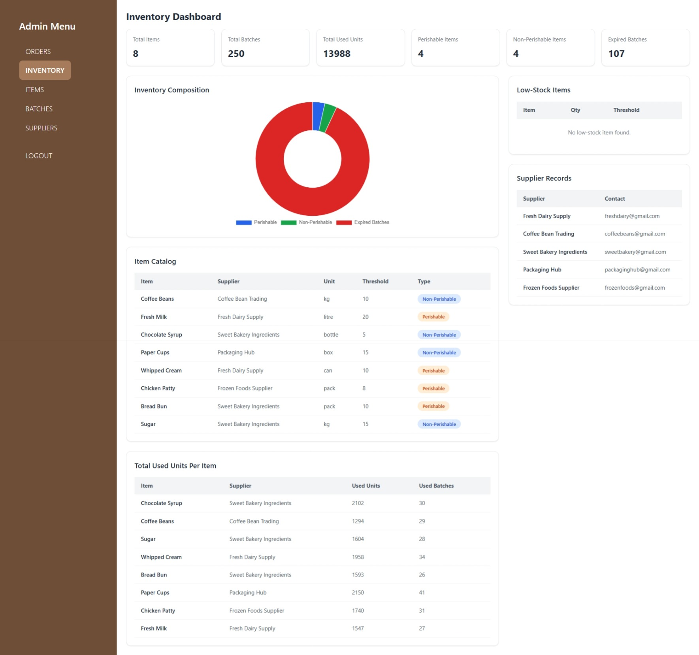

### Items
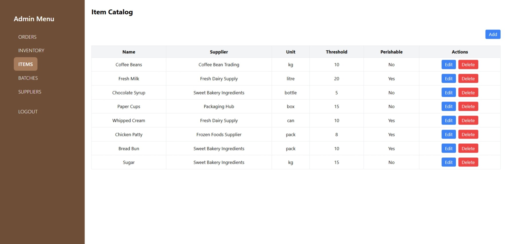

### Batches
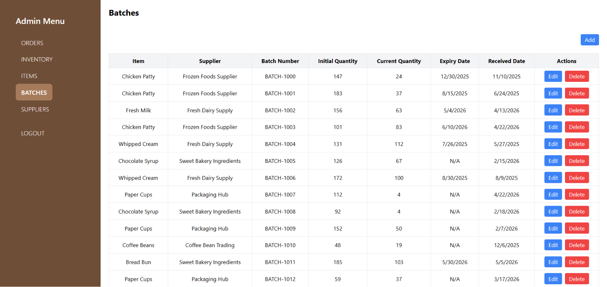

### Suppliers
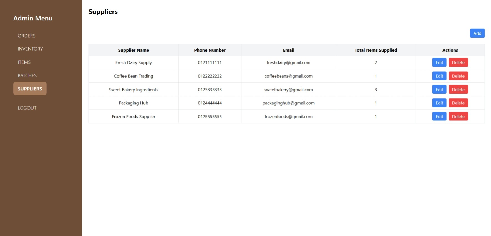